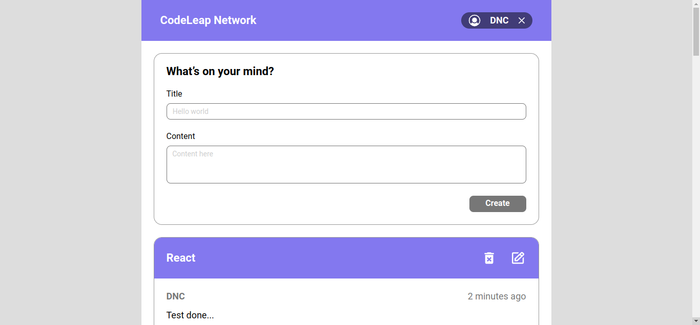

  

  

## 💻 Projeto / Project

Aplicação de cadastro de mensagens utilizando funções básicas CRUD e salvando no Banco de Dados através da API para um teste de codificação para a ***Codeleap***.

_Message registration application using basic CRUD functions and saving in the Database through the API for a coding test for the ***Codeleap***._
  

## 🪄 Design do Projeto / Design of the Project

  

### ⚡Funcionalidades / Features:
---

- Login/Logout do usuário (_Login/Logout of the user_)

- Lista Mensagens do Banco de Dados (_List Messages of the Database_)

- Paginação a cada 10 mensagens listada, através do botão "Carregar Mais" (_Pagination for every 10 messages listed, through the "Load More" button_)

- Criar Mensagem (_Create Message_)

- Alterar Mensagem (_Update Message_)

- Apagar Mensagem (_Delete Message_)

- Aplicação Responsiva (_Responsive Application_)

 

[ACESSE A APLICAÇÃO AQUI !!! / ACCESS THE APPLICATION HERE !!! ](https://darciocarvalho.github.io/codeleap-test/)

 

## ✨ Tecnologia / Technology

- [TypeScript](https://www.typescriptlang.org/)
- [React](https://reactjs.org/)
- [Vite](https://vitejs.dev/)
- [Tailwind CSS](https://tailwindcss.com/)
- [React Redux](https://react-redux.js.org/)
- [Radix UI](https://www.radix-ui.com/)
- [date-fns](https://date-fns.org/)
- [Axios](https://axios-http.com/ptbr/)
- E muitas outras… (_And more other_)

## 🚀 Como executar / How to run

- Instale o [Node.js](https://nodejs.dev/) / _Install the [Node.js](https://nodejs.dev/)_
- Instale o [npm](https://www.npmjs.com/package/npm) / _Install the [npm](https://www.npmjs.com/package/npm)_
- Instale os pacotes com `npm install`. / _Install the packages with `npm install`._
- Execute `npm run dev` para iniciar o cliente web. / _Run `npm run dev` to start the web application._

## 📝 License

Esse projeto está sob a licença MIT. Veja o arquivo [LICENSE](LICENSE) para mais detalhes.
(_This project is licensed under the MIT. See the file [LICENSE](LICENSE) for more details_)

---

  Feito com 💙 by Dárcio Carvalho /  Done with 💙 by Dárcio Carvalho

